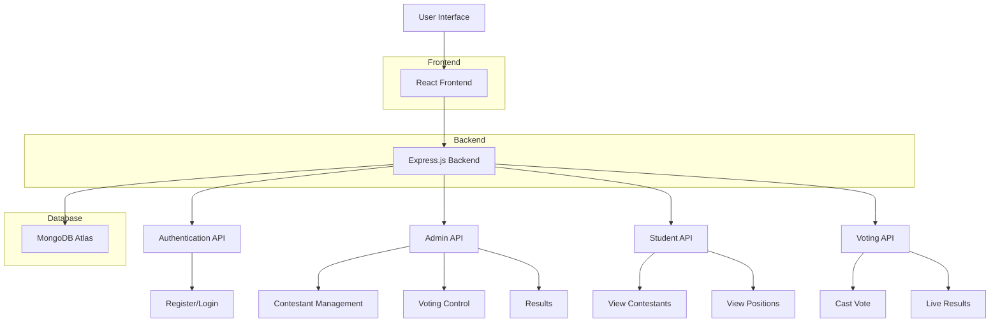

# Gapsight College Voting System - Architecture

## System Components

### 1. Frontend (React)
- **Admin Dashboard**
  - Voting control panel
  - Contestant management
  - Results visualization
  
- **Student Dashboard**
  - Voting interface
  - Live results
  - Profile management

### 2. Backend (Node.js/Express)
- **Authentication Service**
  - Student registration/login
  - Admin login
  - JWT token management

- **Admin Service**
  - Contestant CRUD operations
  - Voting session management
  - Results aggregation

- **Student Service**
  - Contestant listing
  - Position status tracking
  - Vote validation

- **Voting Service**
  - Vote casting
  - Real-time results
  - Vote counting

### 3. Database (MongoDB Atlas)
- **Users Collection**
  - Student information
  - Unique admission numbers

- **Admins Collection**
  - Admin credentials

- **Contestants Collection**
  - Candidate information
  - Position details
  - Manifestos
  - Vote counts

- **Voting Sessions Collection**
  - Session status
  - Schedule information

- **Votes Collection**
  - Vote records
  - Student-position mapping